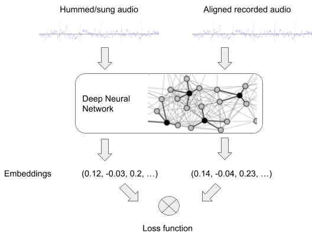
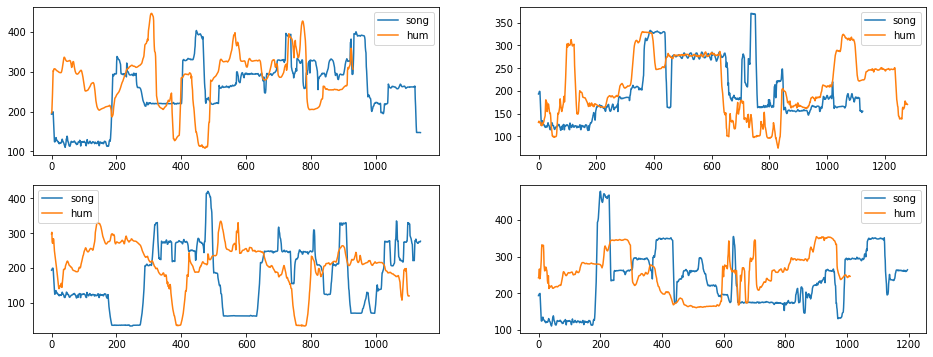
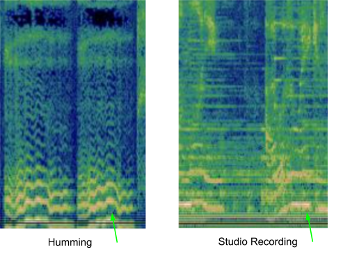

# Hum to find your song
My attempts to the Zalo AI challenge 2021. My solution got 0.5 [Mean reciprocal rank](https://en.wikipedia.org/wiki/Mean_reciprocal_rank) on public leaderboard, ranked 19th, which is not that good but I decided to share my project and my experimental results anyway.

## In this repository
- core/ contains all the code for training and preprocessing
- crepe_freq/ contains all the transformed data from raw audio wave to fundamental frequencies
- meta_data/ contains the data annotations
- template_models/ contains an example of a Pytorch model on MNIST, don't care about it.

*The full data is not mine, I can not share it, but do share the transformed CREPE data anyway*

## The task

Given a ~12secs hum melody of a song, find a song in your database that the user is trying to express. Your database may very large and your hum query may not accurate.

## My solution

First, there are some resources that I  researched and based my solution on:

1. [Now Playing: Continuous low-power music recognition.](https://arxiv.org/abs/1711.10958)
2. [FaceNet: A Unified Embedding for Face Recognition and Clustering](https://arxiv.org/abs/1503.03832)
3. [ The Machine Learning Behind Hum to Search ](http://ai.googleblog.com/2020/11/the-machine-learning-behind-hum-to.html)
4. [Google’s Next Generation Music Recognition](http://ai.googleblog.com/2018/09/googles-next-generation-music.html)
5. [Triplet Loss and Online Triplet Mining in TensorFlow | Olivier Moindrot blog (omoindrot.github.io)](https://omoindrot.github.io/triplet-loss)

Second, some repositories that I have used in my solutions:

1. ​    [hsd1503](https://github.com/hsd1503)    /      **[resnet1d](https://github.com/hsd1503/resnet1d)**     
2. ​    [NegatioN](https://github.com/NegatioN)    /      **[OnlineMiningTripletLoss](https://github.com/NegatioN/OnlineMiningTripletLoss)**  
3. ​    [marl](https://github.com/marl)    /      **[crepe](https://github.com/marl/crepe)**  
4. ​    [facebookresearch](https://github.com/facebookresearch)    /      **[faiss](https://github.com/facebookresearch/faiss)**  

Take a look at the cited resources to better understand the next stuffs.

In a short way, my solution is:

1. Use CREPE to predict the fundamental frequencies of both the hum query audio and the song audio.
2. Train a Resnet1d on those fundamental frequencies with triplet loss to create embeddings such that song and hum audios are near to each others if they refer to the same song id.
3. Transform the whole database of music into database of embeddings using the trained Resnet1d, then given a hum embedding, use Facebook's faiss to search for K nearest embeddings. 
4. Use some heuristic to rank the retrieved embeddings, which's not the best way.

There are at least two things for this retrieval system to work well:

1. Good embeddings
2. Good ranking algorithm

We need a good embedding model that can discriminate positive and negative samples. Then, we need a good ranking algorithm to rank the retrieved songs, because if we only use L2 distance, we will get a lot of false positives.

### Good embeddings

First, how do we decide the length of the hum sample to train our embedding model? In the Google blog posts, they split the hum query into many samples of length 0.5-1 seconds of spectrogram, with the benefit of reduce false positive when you rank your retrieved results, because one hum chunk can have many false positives but if our query have, say 5 chunks, then if 5 chunks both suggest one song then that song must be the one we are looking for.

> It’s critical to the accuracy of Now Playing to use a sequence of  embeddings rather than a single embedding. The fingerprinting neural  network is not accurate enough to allow identification of a song from a  single embedding alone — each embedding will generate a lot of false  positive results. However, combining the results from multiple  embeddings allows the false positives to be easily removed, as the  correct song will be a match to every embedding, while false positive  matches will only be close to one or two embeddings from the input  audio. - [Google’s Next Generation Music Recognition ](http://ai.googleblog.com/2018/09/googles-next-generation-music.html)

The model, in general, looks like this, image from Google blog post cited above, train with triplet loss:

However, I tried this way with sample length of 2 and 4 seconds spectrogram (because I was afraid that if the chunks are too short it will not contain very much information), hop length 0.5 seconds on raw audio signals and it didn't work, or maybe because my model wasn't big enough or I have not trained it long enough, I will never know why... 

But then, I notice that the hum audios are not perfectly aligned with the corresponding songs, for example someone may hum a 20secs worth of recorded music in just 10secs (or more, or less), if you split your audio into chunks of 2 secs or less, how do you make sure that the aligned (hum, song) tuple  will align exactly (don't tell me to manually align them)? And imagine that if we require the hummer to hum a melody of a 10secs chunk of a recorded song in exactly 10secs, it would not be practical since they are not professional singers.

So I decided to use the whole hum audio of 10 or more seconds to be one sample with the given recorded song, again even the given data is not exactly aligned, we may encounter samples that have 6secs of humming audio but 13 secs of recorded audio! But I expected that the model will somehow learn the similar melody in the song and the hummed audio, and match them together.

But then, I thought that instead of hoping the model to learn about melody, pitch and compare them in just 2600 tuple of (song, hum) (The whole training set has 2900 tuple of (song, hum), minus 300 tuples for validation), each sample about 10secs, why don't we just give it the fundamental frequencies of those samples by using a pretrained model? 

With that new idea, I search Google and found CREPE, a pretrained model to extract fundamental frequencies on raw audios. I decided to use that model as a preprocessing step on my data.

Let's take a look at transformed (song, hum) after transformed by CREPE:

The x axis is the time axis, each step worth 10 milliseconds, which means 1200 equals 12seconds.

Now let's take a look at spectrogram of one tuple (song, audio), taken from the Google blog post:

You can observe yourself that in the CREPE transformed features, there is a slight mismatch between the hum and song features, but they do match to some degree if they have the same melody! On the other hand, looks at the spectrogram, can you spot the similarity? Now I am not say that if we can not spot the similarity then the same as the model, what I am trying to say is that the model's life will much easier if we use the CREPE frequencies.

Next, I train a Resnet1d on 2600 pairs of (hum, song), compare with naïve nearest neighbor search on L2 distance give me ~0.27 MRR on public leaderboard and ~0.4x MRR on my validation set. This means that the embedding model worked, what I need to do next is just find a better model parameters and a better ranking algorithm.

Why does the model perform much worse on public test compare to local validation set, you ask? Well I'm glad you ask, because in the validation set we have already aligned tuple of (hum, song) (although not perfectly), each hum/song is about 10secs, but in the public test set the hummed audios are about 10secs but the provided recorded songs are about more than 30secs, which means we have to find a way to slide and match the hummed audios to the recorded songs, which eventually degrade the MRR.

## Good Ranking algorithm 

Let's think about the problem, a user only hum 10secs or less about one song melody, but our database have thousand of songs with full length, about 4 minutes each. We can not just compare two different length audio together, we need to split the full song into many overlapping chunks and consider the hop length as a hand-tune hyperparameter. 

There are two way to rank the K nearest song's chunks in this stage, depends on the way you split you data in the previous stage:

1. If you split your hummed audios into multiple chunks of length a few seconds as in the Google blog posts, then you have the benefit of reduce false positives as I have mentioned above, and you can use a probabilistic model to rank the results as mentioned in the Now playing paper, cited above. 
2. If you don't split your data, then one hummed audio has one single embedding vectors of d dimension, and one song can have multiple embedding vectors of dimension d since you split your song into overlapping chunks. The next question is how to rank the K nearest song's chunks embeddings, knowing that there will have a lot of false positive?

My solution belongs to the above second situation, and here is the way I solve the ranking problem: First assume that if the embedding model is good, so if a hum audio refer to a song, then some of the song's chunks embeddings will be in the K nearest neighbors of that hum's embedding. Since the song's chunks are overlapping by a a length of hop lengths, which is usually pretty small, even if the (hum, song) embeddings misaligned a few seconds we still hope that it will near to each others in the embeddings space.

Then, we can see that given a single hum's embeddings vector, we will find K nearest neighbors of that embedding, and if in that K nearest neighbors, there are multiple chunks of the same song appear, then that song will has high probability of being the true song. That is the way I used.

## My final solution

My best submission come from a model with the following configuration:

- Tuple of (song, hum) has ~12secs length each in the given data, when training we'll random crop the sample of length 8secs and train, which I thinks will give more samples for training and make the model more robust.
- Train for 1400 epochs (on Kaggle notebook, thanks Kaggle), it took about 2 hours.
- The training time is not that long, you said, well the transforming from raw wave audio to frequencies step using CREPE is where it takes times.

That's it. My solution got 0.5 MRR on public leaderboard, again is not that good, but I bet it because of the ranking phase, I don't have a good ranking model, but we know one thing from this project is that the embedding model works!

